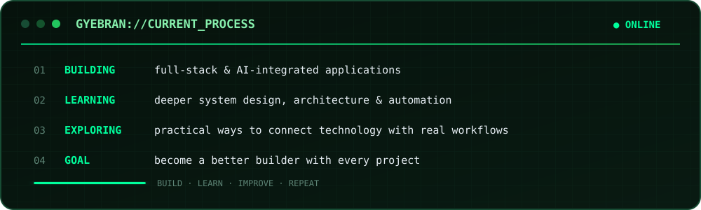
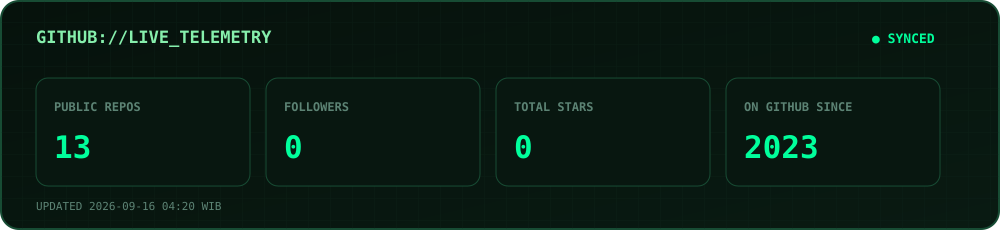

<div align="center">



<br />

<a href="https://github.com/Gyebran/gyebran-portfolio">
  
</a>
<a href="mailto:gyebran777@gmail.com">
  
</a>
<a href="https://github.com/Gyebran?tab=repositories">
  
</a>

<br /><br />


</div>

---

## `> who am i`


```text
NAME       Gyebran Nauri Haikal
ROLE       Full-Stack Developer & Information Systems Student
FOCUS      Web Development · AI Integration · System Architecture
EDUCATION  Information Systems @ Telkom University
MODE       Building · Learning · Improving
STATUS     ONLINE
```

I build digital products by combining **software development, systems thinking, business processes, and AI**. I enjoy working across frontend, backend, databases, APIs, and architecture—especially when the product solves a clear workflow or operational problem.

<br clear="right" />

<details>
<summary><b>▸ Open extended profile</b></summary>
<br />

I like projects where software is more than an interface: products with clear workflows, useful data, maintainable architecture, and a reason to exist.

My work and learning have taken me through web development, BPMN and business processes, system architecture and governance, backend services, databases, AI-assisted applications, and enterprise operations.

</details>

---

## `> experience timeline`

<table>
<tr>
<td width="17%"><code>2023 — Present</code></td>
<td>
<b>Information Systems Student</b><br />
<sub>Telkom University</sub><br /><br />
Started studying Information Systems in 2023, building a foundation across software development, databases, business processes, system architecture, enterprise systems, and digital technology.
</td>
</tr>
<tr>
<td><code>2025</code></td>
<td>
<b>AI BPMN Maker Development Team</b><br />
<sub>AI BPMN Maker</sub><br /><br />
Joined the development team behind AI BPMN Maker, contributing to an AI-assisted solution designed around Business Process Model and Notation workflows and process modeling.
</td>
</tr>
<tr>
<td><code>2025</code></td>
<td>
<b>Laboratory Instructor — System Architecture & Governance</b><br />
<sub>Telkom University</sub><br /><br />
Served as an instructor in the System Architecture and Governance laboratory, supporting learning activities around system architecture, governance, and enterprise information systems.
</td>
</tr>
<tr>
<td><code>2026</code></td>
<td>
<b>Human Resource Service Operation Intern</b><br />
<sub>Telkom Indonesia</sub><br /><br />
Joined Telkom Indonesia as an intern in the Human Resource Service Operation unit, gaining exposure to enterprise HR service processes, operational workflows, and large-scale internal services.
</td>
</tr>
</table>

---

## `> tech arsenal`

<div align="center">

&nbsp;&nbsp;&nbsp;
&nbsp;&nbsp;&nbsp;
&nbsp;&nbsp;&nbsp;
&nbsp;&nbsp;&nbsp;
&nbsp;&nbsp;&nbsp;
&nbsp;&nbsp;&nbsp;


<br /><br />

&nbsp;&nbsp;&nbsp;
&nbsp;&nbsp;&nbsp;
&nbsp;&nbsp;&nbsp;
&nbsp;&nbsp;&nbsp;
&nbsp;&nbsp;&nbsp;
&nbsp;&nbsp;&nbsp;


</div>

<br />

```text
FRONTEND   React · Next.js · TypeScript · Tailwind CSS · Three.js
BACKEND    Laravel · PHP · Node.js · REST API
DATA       PostgreSQL · Supabase
TOOLS      Git · Docker · Vercel
INTERESTS  AI Integration · BPMN · System Architecture · Automation
```

---

## `> featured projects`

<table>
<tr>
<td width="50%" valign="top">
<h3>◈ <a href="https://github.com/Gyebran/gyebran-portfolio">gyebran-portfolio</a></h3>
<p>Interactive personal portfolio with a motion-heavy React interface and Three.js hero experience.</p>
<p><code>React</code> <code>Three.js</code> <code>GSAP</code> <code>Vite</code></p>
<a href="https://github.com/Gyebran/gyebran-portfolio"><b>Open repository →</b></a>
</td>
<td width="50%" valign="top">
<h3>◈ <a href="https://github.com/Gyebran/WEB_PEMINJAMAN_RUANGAN">Web Peminjaman Ruangan</a></h3>
<p>Room reservation platform built around a modern TypeScript workflow and Supabase-backed data.</p>
<p><code>Next.js</code> <code>TypeScript</code> <code>Supabase</code> <code>Tailwind</code></p>
<a href="https://github.com/Gyebran/WEB_PEMINJAMAN_RUANGAN"><b>Open repository →</b></a>
</td>
</tr>
<tr>
<td valign="top">
<h3>◈ <a href="https://github.com/Gyebran/backend-interactive-edutainment">Interactive Edutainment</a></h3>
<p>Interactive education platform using a simple microservices approach with AI integration.</p>
<p><code>Node.js</code> <code>TypeScript</code> <code>Docker</code> <code>Gemini</code></p>
<a href="https://github.com/Gyebran/backend-interactive-edutainment"><b>Open repository →</b></a>
</td>
<td valign="top">
<h3>◈ <a href="https://github.com/Gyebran/backend-etani">E-Tani API</a></h3>
<p>Weather-aware Express backend that turns forecast conditions into practical farming recommendations.</p>
<p><code>Node.js</code> <code>Express</code> <code>REST API</code> <code>Weather Logic</code></p>
<a href="https://github.com/Gyebran/backend-etani"><b>Open repository →</b></a>
</td>
</tr>
</table>

<p align="right"><a href="https://github.com/Gyebran?tab=repositories"><b>View all repositories →</b></a></p>

---

## `> matrix console`

<div align="center">
  
</div>

---

## `> github metrics`

<div align="center">
  
</div>

<sub>Self-hosted metrics · refreshed automatically from GitHub API</sub>

---

## `> recent activity`

<!--RECENT_ACTIVITY:start-->
<table>
<tr><th>EVENT</th><th>REPOSITORY</th><th>DETAIL</th></tr>
<tr><td><code>PUSH</code></td><td><a href="https://github.com/Gyebran/GoWork"><b>Gyebran/GoWork</b></a></td><td>1 commit</td></tr>
<tr><td><code>PUSH</code></td><td><a href="https://github.com/Gyebran/gyebran-portfolio"><b>Gyebran/gyebran-portfolio</b></a></td><td>1 commit</td></tr>
<tr><td><code>CREATE</code></td><td><a href="https://github.com/Gyebran/gyebran-portfolio"><b>Gyebran/gyebran-portfolio</b></a></td><td>branch main</td></tr>
</table>
<!--RECENT_ACTIVITY:end-->

<sub>
<!--RECENT_ACTIVITY:last_update-->
Last updated: Friday, September 11, 2026 · 03:51 WIB
<!--RECENT_ACTIVITY:last_update_end-->
</sub>

---

## `> contribution snake`

<div align="center">

<picture>
  <source media="(prefers-color-scheme: dark)" srcset="https://raw.githubusercontent.com/Gyebran/Gyebran/output/github-snake-dark.svg" />
  <source media="(prefers-color-scheme: light)" srcset="https://raw.githubusercontent.com/Gyebran/Gyebran/output/github-snake-light.svg" />
  
</picture>

</div>

---

<div align="center">

### `> build_the_right_things(); keep_learning();`

<sub>Different tools. Same curiosity.</sub>

<br /><br />

<a href="https://github.com/Gyebran/gyebran-portfolio">
  
</a>
<a href="mailto:gyebran777@gmail.com">
  
</a>

</div>
